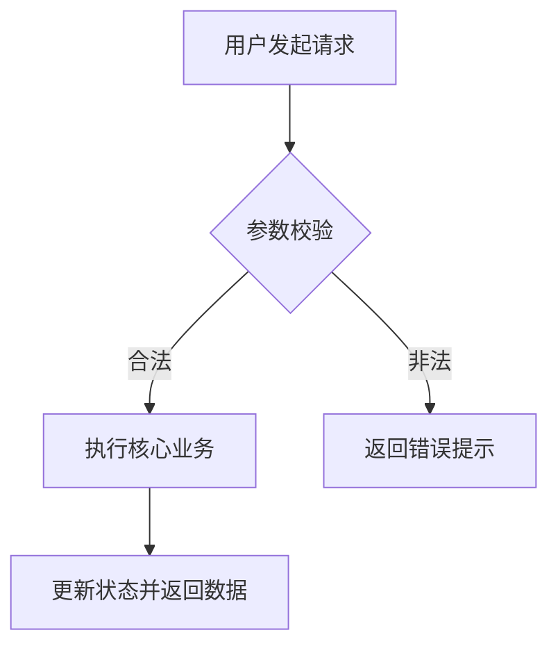

# 需求分析与 PRD 编写 (Requirement Writer) Skill

**核心原则：无二义性、结构清晰、逻辑闭环、边界明确、具备可验收性（Testable）。**

## 何时使用

- 将产品规划、业务想法或模糊需求转化为详细的 PRD（产品需求文档）时
- 编写用户故事（User Story）及敏捷验收准则（Acceptance Criteria）时
- 梳理详细的业务逻辑分支、状态流转机（State Machine）与异常边界情况时
- 制定前端/后端数据交互字段说明（数据字典）与权限控制规则时
- 为开发和测试团队提供无歧义的需求基准时

---

## 核心工作流与操作步骤

### 1. 结构化需求拆解
- 采用 **INVEST 原则** 拆分用户故事：
  - **I**ndependent（独立性）
  - **N**egotiable（可协商）
  - **V**aluable（有价值）
  - **E**stimable（可估算）
  - **S**mall（小颗粒度）
  - **T**estable（可测试）

### 2. 标准用户故事格式
- **As a** [用户角色 / 身份]
- **I want to** [执行某种操作 / 获取某种功能]
- **So that** [达成某种业务目标 / 获得某种价值]

### 3. Gherkin 结构化验收准则 (Acceptance Criteria)
每个关键功能必须包含 Given-When-Then 场景：
- **Scenario**: 正常路径（Happy Path）
  - **Given** [前置状态 / 条件]
  - **When** [触发动作 / 事件]
  - **Then** [系统响应 / 预期结果]
- **Scenario**: 异常/边界路径（Edge Cases & Failures）
  - **Given** [如：网络超时 / 无权限 / 数据为空 / 输入超长 / 重复提交]
  - **When** [触发动作]
  - **Then** [友好的错误提示 / 状态回滚 / 重试机制]

### 4. 业务逻辑与状态机设计
- 梳理实体所有生命周期状态（例如：草稿 $\rightarrow$ 待审核 $\rightarrow$ 处理中 $\rightarrow$ 成功 / 失败 $\rightarrow$ 已归档）。
- 明确每个状态之间的**触发条件（Events）**、**前置校验（Guards）**及**后置动作（Actions）**。

### 5. 边界与非功能性需求（NFR）
- **性能指标**：响应延迟（P95/P99）、并发吞吐量。
- **安全与权限**：鉴权机制、敏感信息脱敏、防重放攻击。
- **兼容性**：设备、分辨率、浏览器版本支持范围。

---

## 标准 PRD 模板

```markdown
# [功能模块名称] 详细需求规格说明书 (PRD)

## 1. 文档信息
- **版本号**: v1.0.0
- **需求状态**: 待评审 / 评审中 / 已定稿
- **涉及端**: Web / H5 / 后端 API

## 2. 业务背景与目标
- **业务背景**: [简述业务诉求]
- **需求目标**: [明确需达成的效果]

## 3. 功能清单与流程图


## 4. 详细功能说明

### 4.1 [子功能名称]
- **用户故事**: 作为一个 [角色]，我希望 [操作]，以便于 [价值]。
- **页面交互与展示规则**:
  - 按钮触发状态：默认 / Hover / Loading / Disabled
  - 空状态（Empty State）与骨架屏展示
- **验收准则 (Acceptance Criteria)**:
  - **场景 1 (正常流)**:
    - *Given*: 用户已登录且账户有可用配额
    - *When*: 点击“生成考卷”按钮
    - *Then*: 按钮进入 Loading 态，并成功跳转至预览页
  - **场景 2 (配额不足)**:
    - *Given*: 用户可用配额为 0
    - *When*: 访问生成页面
    - *Then*: 按钮置灰禁用，并显示 Tooltip “可用配额不足，请升级”
  - **场景 3 (网络超时/接口异常)**:
    - *Given*: 服务端超时未返回
    - *When*: 请求耗时超过 15s
    - *Then*: 弹出 Toast “生成超时，请稍后重试”，保留当前草稿输入

## 5. 数据字典与接口字段定义
| 字段名 | 字段类型 | 必填 | 校验规则 / 约束 | 说明 |
| :--- | :--- | :--- | :--- | :--- |
| `title` | String | 是 | 长度 1-100 字符 | 考卷标题 |
| `question_type` | Enum | 是 | `SINGLE_CHOICE`, `MULTIPLE_CHOICE`, `ESSAY` | 题型 |
| `score` | Integer | 是 | 范围 [1, 100] | 单题分值 |

## 6. 非功能性需求 (NFR)
- 接口响应耗时：P95 < 800ms
- 幂等性保障：支持防重提交 Token
```

---

## 需求评审检查清单 (Checklist)

- [ ] 流程是否闭环（每个分支都有明确终点）？
- [ ] 是否覆盖了所有极端输入（超长字符串、特殊字符、负数、空值）？
- [ ] 权限与并发场景是否有明确降级或拦截策略？
- [ ] 报错信息是否对用户友好且具备指导性操作？
